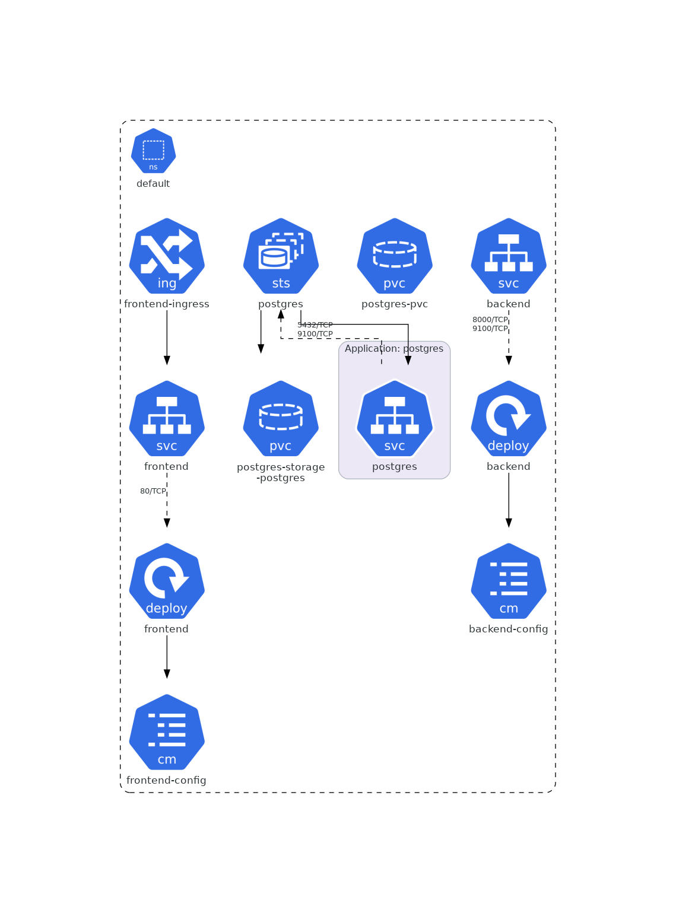

# Sample Kubernetes Application

This repository demonstrates deploying a sample application stack—**web frontend**, **backend API**, and **PostgreSQL database**—using:

- Plain Kubernetes manifests
- Helm charts
- FluxCD GitOps manifests

It also includes GitHub Actions workflows for automated CI/CD deployments using either manifests or Helm charts.

---

## Application Structure



## Project Structure

```
kubernetes/         # Plain Kubernetes manifests
  web-ui/           # Frontend manifests
  web-app/          # Backend manifests
  database/         # Postgres and pgBouncer manifests

helm/               # Helm charts for frontend and backend
  web-ui/           # Frontend Helm chart
  backend/          # Backend Helm chart

fluxcd/
  dev/              # FluxCD manifests for dev environment
  prod/             # FluxCD manifests for prod environment

.github/workflows/  # GitHub Actions workflows
```

---

## Deployment Options

### 1. Plain Kubernetes Manifests

**Prerequisites:**  
- Kubernetes cluster  
- `kubectl` installed
- Kubernetes secret `db-secret` created in target namespace as follows:
```sh
kubectl create secret generic db-secret \
  --from-literal=DB_NAME=sampledb \
  --from-literal=DB_USER=sampleuser \
  --from-literal=DB_PASS=samplepass
```

**Deploy:**
```sh
kubectl apply -k kubernetes/
```

### 2. Helm Charts

**Prerequisites:**  
- Kubernetes cluster  
- `helm` installed  
- Access to OCI registry for charts
- Kubernetes secret `db-secret` created in target namespace as follows:
```sh
kubectl create secret generic db-secret \
  --from-literal=DB_NAME=sampledb \
  --from-literal=DB_USER=sampleuser \
  --from-literal=DB_PASS=samplepass
```

**Deploy:**
```sh
helm registry login <oci-registry> --username <username> --password <password>

helm upgrade --install frontend oci://<oci-registry>/frontend --version 0.1.0 --namespace <namespace>
helm upgrade --install backend oci://<oci-registry>/backend --version 0.1.0 --namespace <namespace>

helm repo add bitnami https://charts.bitnami.com/bitnami
helm upgrade --install postgres bitnami/postgresql \
  --namespace <namespace> \
  --set architecture=replication \
  --set replicaCount=3 \
  --set auth.username=sampleuser \
  --set auth.password=samplepass \
  --set auth.database=sampledb
```

### 3. FluxCD GitOps

You may wish to read [this](https://www.gitops.tech/), [this](https://fluxcd.io/flux/get-started/) and [this](https://fluxcd.io/flux/concepts/) first. GitOps workflows and tooling require some up-front planning, but really come into their own at scale.

**Prerequisites:**  
- FluxCD installed in your cluster. See [here](https://fluxcd.io/flux/installation/) for detailed instructions on bootstrapping FluxCD and setting up a GitOps flow for application deployment.

**Deploy:**
```sh
kubectl apply -f fluxcd/dev/kustomization.yaml
kubectl apply -f fluxcd/prod/kustomization.yaml
```
Or apply HelmRelease manifests in `fluxcd/dev/` or `fluxcd/prod/`.

---

## CI/CD Workflows

### Prerequisites
 A GitHub Actions repository secret named `KUBECONFIG` has been created and contains valid credentials for access to the target Kubernetes cluster. See [here](https://notes.kodekloud.com/docs/GitHub-Actions-Certification/Continuous-Deployment-with-GitHub-Actions/Workflow-Configuring-Kubeconfig-file) for detailed instructions on this step.

### Kubernetes Manifests

See `.github/workflows/deploy-k8s.yaml`:
- Checks out code
- Sets up `kubectl`
- Creates secrets from workflow inputs
- Applies manifests using Kustomize
- Verifies deployments

### Helm Charts

See `.github/workflows/deploy-helm.yaml`:
- Checks out code
- Sets up `kubectl` and `helm`
- Creates secrets from workflow inputs
- Logs in to OCI registry
- Installs/updates charts
- Verifies deployments

---

## Notes

- Update image names, registry URLs, and secrets as needed.
- TLS secrets for Ingress must be created in advance.

---

## Improvements / TODO

- Add [pgBouncer](https://www.pgbouncer.org/) for PSQL connection pooling.
- Use the [CloudNative PG Operator](https://cloudnative-pg.io/) for native high-availability, connection pooling, remote WAL archiving, and streaming replication.
- Enable [service monitors](https://observability.thomasriley.co.uk/prometheus/configuring-prometheus/using-service-monitors/) to obtain application metrics if you are using Prometheus for observability.
- Use the [External Secrets Operator](https://external-secrets.io/latest/) for Kubernetes to manage sensitive credentials and make them available to Kubernetes workloads.
- Use [Cert Manager](https://cert-manager.io/) to manage TLS certificates needed for ingress.

---